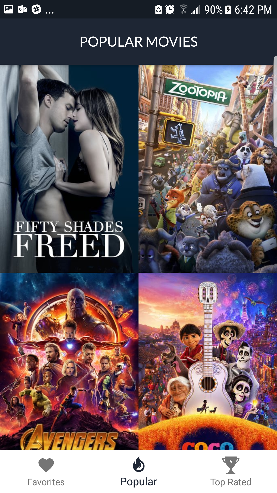
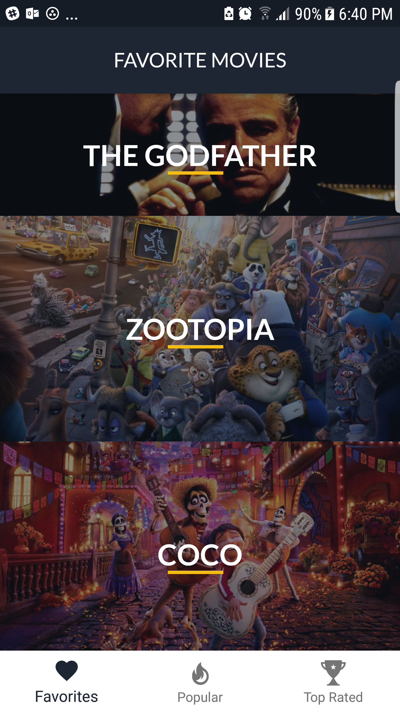
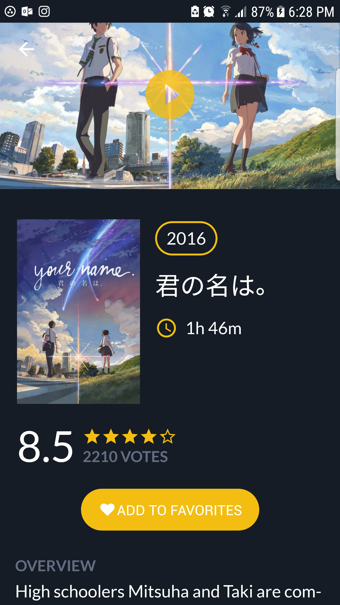
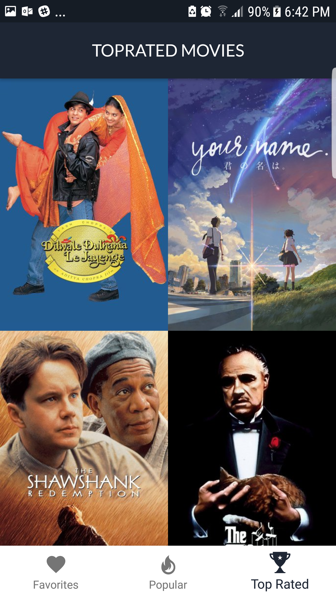
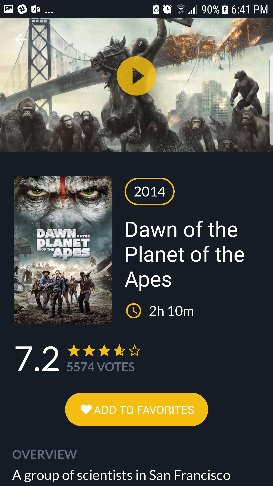
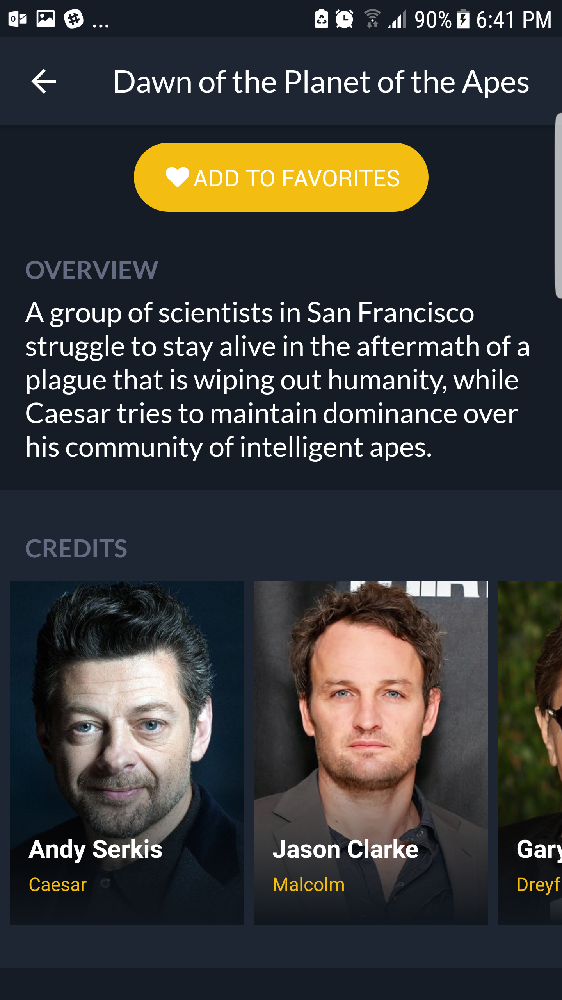
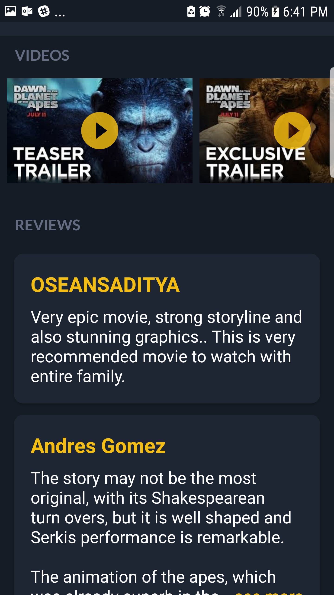

# Popular Movies
app that allow users to discover the most popular movies playing as well as save his favorite movies for later, this app is a fun experiment

## Screenshots
            

## Libraries and SDKs Used
- [Android Support Libraries](https://developer.android.com/topic/libraries/support-library/packages.html) 
- [Retrofit](http://square.github.io/retrofit/)
- [Gson](https://github.com/google/gson)
- [Picasso](http://square.github.io/picasso/)
- [Fancy Buttons](https://github.com/medyo/Fancybuttons)
- [Material Rating Bar](https://github.com/DreaminginCodeZH/MaterialRatingBar)
- [Material Dialogs](https://github.com/afollestad/material-dialogs)
- [EllipsizeTextView](https://github.com/dinuscxj/EllipsizeTextView)

## Notes
Get your own API key from [here](https://www.themoviedb.org),And then Make sure to add this line to your API_KEY="your_api_key" in service Generator

